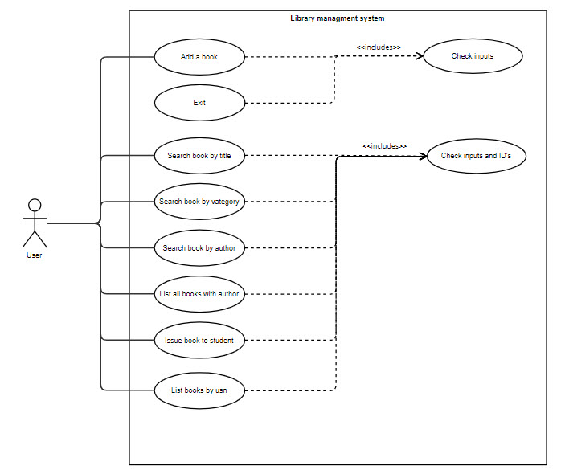

# Iron-Library

Este programa permite al usuario gestionar el sistema interno de una librería, pudiendo realizar diferente gestiones, como por ejemplo: 

1.- Añadir un libro. 
2.- Buscar libros por su título.  
3.- Buscar libros por su categoría.  
4.- Buscar libros por su autor.  
5.- Listar todos los libros de un autor.  
6.- Asignar libros a estudiantes.  
7.- Mostrar libros asociados a un estudiante.  
8.- Mostrar libros que deban entregarse ese día.  
9.- Salir de la aplicación. 

Para poder realizar cada una de estas funciones, el usuario debe pasar por consola la opción numérica correspondiente. Toda entrada por consola tiene su control de errores.

## Packages: 

### 1.- Assets

Este paquete contiene las siguientes clases: 

Constants: Almacena las constantes relacionadas a los códigos de color de fuente. 

InputExcepcion: Almacena una excepción personalizada, a partir de la clase Excepcion, que será utilizada para el control de errores. 

InputKeyboard: Contiene todos los métodos relacionados al input de parámetros por parte del usuario. 

Utils: Contiene todos los métodos con la lógica necesaria para el desarrollo de la aplicación. 

### 2.- Models

Este paquete contiene las siguientes clases: 

Book

Author

Student

Issue 

Cada una de estas clases contempla las variables correspondientes a cada entidad de la base de datos. 

### 3.- Repository

Este paquete contiene los repositorios de cada una de las clase que son utilizados para la inyección de dependencias. 

## UML Diagram 

Créditos

Este proyecto se ha realizado gracias a los siguientes colaboladores:

[Teresa Mira](https://github.com/Teresa2594) 
[Victor Sobrinos](https://github.com/VictorSobrinos) 
[Fernando Camacho](https://github.com/fernandojcm) 
[Martina Dorado](https://github.com/MartuDorado) 

